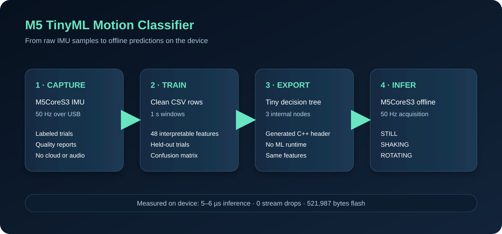

# M5 TinyML Motion Classifier

An M5CoreS3 learns three motion states from its IMU and runs the classifier locally:

`STILL` · `SHAKING` · `ROTATING`

The pipeline is deliberately small and easy to inspect: collect USB data, train on a laptop, export a tiny decision tree, then run the same feature pipeline on the M5. No Wi-Fi, microphone, cloud API, or extra hardware is required.



## Result

- **84.9% held-out window accuracy** on a later recording session
- **5–6 µs** measured prediction time on the M5CoreS3
- **0 stream drops** after moving prediction to 2 Hz
- Classifier firmware: **521,987 bytes flash**, **27,468 bytes static RAM**
- Clean dataset used: **6 still, 5 shaking, 5 rotating trials**

This is a working portfolio prototype, not a production accuracy claim. The dataset is small and the classes can briefly flicker during transitions.

## How it works

```text
M5 IMU at 50 Hz
      ↓
1-second window: 50 samples
      ↓
48 features: axes + magnitudes + statistics + motion differences
      ↓
3-level decision tree
      ↓
STILL / SHAKING / ROTATING on the display
```

The classifier uses six raw IMU axes plus acceleration and gyro magnitudes. For each signal it calculates mean, standard deviation, minimum, maximum, RMS, and mean absolute first difference. The embedded tree has three internal decision nodes and four leaves.

## Upload the live classifier

Open [`motion_classifier.ino`](firmware/motion_classifier/motion_classifier.ino) in Arduino IDE and select:

- Board: **M5CoreS3**
- PSRAM: **OPI PSRAM**
- USB CDC on boot: **Enabled**
- Libraries: **M5CoreS3**, **M5Unified**, **M5GFX**

Upload by USB. The display warms up for one second and then shows predictions. Open Serial Monitor at **115200** to see:

```text
# PREDICTION,161,STILL,5,0
```

The fields are prediction number, label, inference time in microseconds, and stream drops. A healthy run keeps stream drops at `0`.

## Collect data yourself

The separate recorder is [`motion_recorder.ino`](firmware/motion_recorder/motion_recorder.ino). It streams timestamped IMU rows over USB at 50 Hz.

```powershell
cd D:\m5-tinyml-deployment-lab
python -m venv .venv
.\.venv\Scripts\python.exe -m pip install -r requirements.txt
.\.venv\Scripts\python.exe capture.py --list-ports
.\.venv\Scripts\python.exe capture.py --port COM11 --label still --session day1 --seconds 20
```

Available labels are `still`, `shaking`, and `rotating`. Run one capture at a time, keep the action consistent, and use only reports with `0 invalid; 0 missing` and no warnings. The recorder keeps incomplete and bad captures visible instead of silently repairing them.

## Train and export

Training uses clean trials only. Windows are 1 second with 50% overlap. Evaluation holds out one complete trial from each class so overlapping windows from the same trial cannot leak into both train and test sets.

```powershell
.\.venv\Scripts\python.exe train_baseline.py
.\.venv\Scripts\python.exe export_embedded.py
```

Generated files go into ignored `data/` and `model/` directories. The embedded header is copied into [`motion_tree.h`](firmware/motion_classifier/motion_tree.h). The desktop Random Forest is retained as a baseline; the M5 uses the much smaller exported decision tree.

Run software tests with:

```powershell
.\.venv\Scripts\python.exe -m unittest -v
```

The tests cover parsing, malformed rows, stale samples, counter rollover, unique trial files, and simulated USB disconnects.

## Engineering notes

The first recorder version produced periodic 59 ms gaps because screen drawing competed with acquisition. Version 0.2 moved IMU sampling into a higher-priority FreeRTOS task with a queue, then the classifier reduced expensive feature extraction to 2 Hz while keeping 50 Hz acquisition. This produced stable 20 ms sampling and zero stream drops in the final live test.

The M5 performs inference offline. No raw audio or personal data is collected. The model has only been tested on one device and a small self-collected dataset; broader users, speeds, orientations, and hardware should be evaluated before making reliability claims.

## Hardware and software

M5CoreS3 · ESP32 Arduino core 3.3.11 · M5CoreS3 1.0.1 · M5Unified 0.2.21 · M5GFX 0.2.28 · Python 3.11
